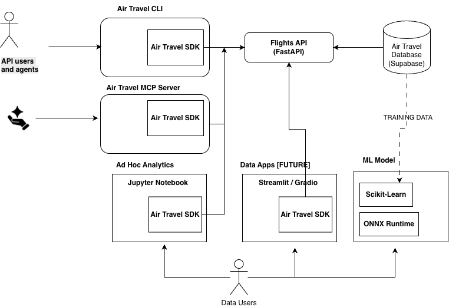

# ✈ Anchor Project - Air Travel ✈ 

Ryan Day's anchor project to explore and demonstrate advanced techniques around the me of data science, APIs, and increasingly LLMs.

As I build stuff here, I write about in my Tip Sheet newsletter. Subscribe here to learn how I build these anchor project components and how you can, too: [subscribe to the Tip Sheet newsletter](https://tips.handsonapibook.com/).

This anchor project has some fairly advanced techniques. If you want to build foundational knowledge of FastAPI APIs for AI and Data Science in Python, I wrote a book you should read! Check it out at [Hands-on APIs for AI and Data Science: Python Development with FastAPI](https://handsonapibook.com).

[Versión en español](README.es.md)

------------------------------------------------------------------------

## Major themes
- Building and using APIs for AI and data science uses
- Using Python asynchronous programming techniques to increase performance and reliability in all areas

------------------------------------------------------------------------

## Architecture Overview

Here's a big picture view of all of the anchor project components.
They show different pieces of an enterprise build around a data source and Python frameworks.

The **Air Travel SDK** serves as the central
integration layer, allowing multiple consumers to reuse the same
functionality while minimizing duplicated code.

------------------------------------------------------------------------
## Technologies used

- Python - pretty much all the code is in Python
- FastAPI - API development platform
- PostgreSQL and Supabase - Cloud PosgreSQL database
- FastMCP - framework for building MCP servers and clients
- Typer - Library to build command line interface (CLI)
- HTTPX - Async library for API calls.
- Scikit-Learn - Python framework for ML model training
- ONNX runtime - Open framework for hosting ML models for inference
- Juypter Notebooks - Every data scientists friend

------------------------------------------------------------------------

## Major themes
# Core Components

## Air Travel CLI

A command-line interface designed for developers, analysts, and AI
coding agents.

The CLI provides a convenient way to search and retrieve flight
information directly from the terminal while leveraging the shared SDK
underneath.

**Repository path:**

[cli/](./cli)

------------------------------------------------------------------------

## Air Travel SDK

The central Python package used throughout the project.

The SDK abstracts the underlying API implementation and provides a
consistent interface for multiple consumers.

It is used by:

-   The Air Travel CLI
-   The MCP Server
-   Jupyter notebooks
-   Streamlit and Gradio applications [FUTURE]

**Repository path:**

[sdk/](./sdk)

------------------------------------------------------------------------

## Flights API

A FastAPI application that exposes flight information through REST
endpoints.

The API acts as the primary access layer for flight data and is consumed
by the SDK.

**Repository path:**

[flights-api/](./flights-api)

------------------------------------------------------------------------

## Air Travel Database

A PostgreSQL/Supabase-backed datastore containing processed airline
operational data.

The Flights API retrieves flight information from this database layer.

**Repository path:**

[postgres/](./postgres)

------------------------------------------------------------------------

## Air Travel MCP Server

An MCP (Model Context Protocol) server that enables AI assistants and
coding agents to interact with the air travel ecosystem through
standardized tooling.

Rather than implementing its own database logic, the MCP server reuses
the shared SDK.

**Repository path:**

[mcp/](./mcp)

------------------------------------------------------------------------

## Ad Hoc Analytics

Jupyter notebooks used for exploratory analysis, experimentation, and
prototyping.

These notebooks demonstrate how analysts can work with the same SDK used
elsewhere in the project.

Typical activities include:

-   Data exploration
-   Feature engineering
-   Hypothesis testing
-   Experimentation

**Repository path:**

[llm/](./llm)

------------------------------------------------------------------------

## ML model training and API model inference

Jupyter notebook demonstrating ML model traing and building an API for inference.

The model trained in this example is pretty naive, so don't look too closely.

But the approach to training and serving inference via API is a solid framework.

**Repository path:**

[ml-models/](./ml-models)

[inference-api/](./inference-api)

------------------------------------------------------------------------

## Data Applications [FUTURE]

Interactive applications built with frameworks such as Streamlit or
Gradio.

These applications will provide end-user experiences while relying on the SDK
to retrieve data.

Potential use cases include:

-   Flight search applications
-   Dashboards
-   Demonstrations
-   AI-assisted experiences

------------------------------------------------------------------------

# Data Source

The project uses publicly available airline operational data from the
U.S. Department of Transportation's Bureau of Transportation Statistics
(BTS).

BTS Data Portal:

https://www.transtats.bts.gov/DL_SelectFields.aspx?gnoyr_VQ=FGK&QO_fu146_anzr=b0-gvzr

------------------------------------------------------------------------

# Other Anchor Project Pieces

## data/

Supporting datasets, ingestion assets, and intermediate artifacts used
throughout the project.

------------------------------------------------------------------------

## llm/

Experiments involving large language models, prompt engineering, and AI
workflows.

------------------------------------------------------------------------

## postgres/

Database infrastructure, schema definitions, and supporting scripts.

------------------------------------------------------------------------

# Getting Started

Clone the repository:

    git clone https://github.com/Ryandaydev/anchor_project_air_travel.git

Explore one of the major entry points:

-   `sdk/` for reusable client functionality
-   `cli/` for command-line workflows
-   `flights-api/` for the REST API implementation
-   `mcp/` for AI agent integrations

------------------------------------------------------------------------

# Design Philosophy

The Anchor Project emphasizes several architectural principles:

-   **One SDK, many consumers** -- shared functionality minimizes
    duplicated logic.
-   **API-first development** -- services communicate through
    well-defined interfaces.
-   **AI-ready architecture** -- MCP servers and agent workflows are
    treated as first-class consumers.
-   **Composable components** -- applications can evolve independently
    while sharing common foundations.
-   **Educational transparency** -- the repository demonstrates
    practical patterns for modern data, API, and AI engineering
    projects.
